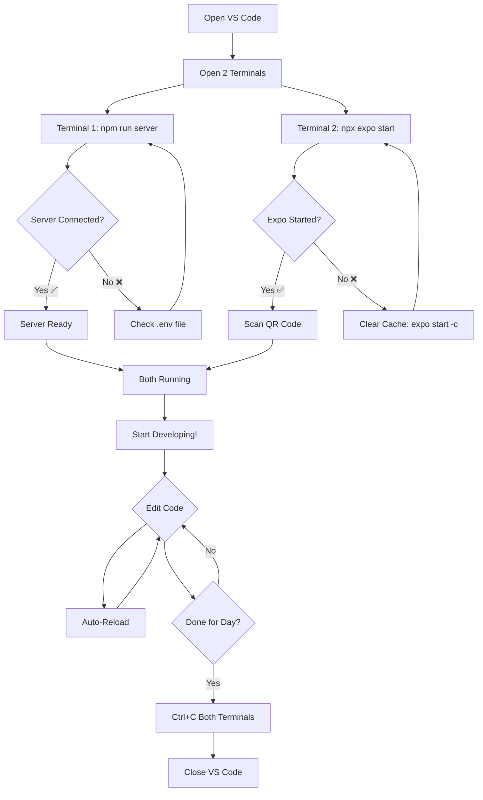
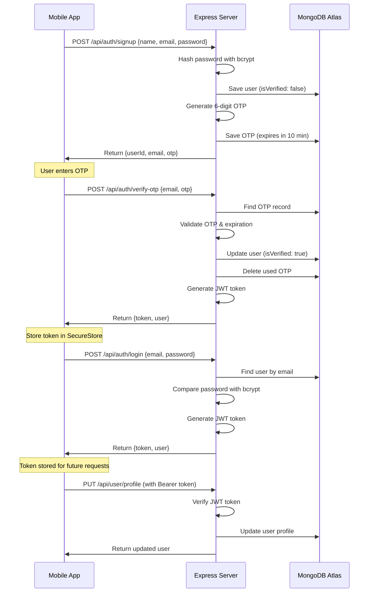

# Development Workflow - Verdict App

## 🔄 Daily Development Cycle



## 📱 User Authentication Flow



## 🏗️ System Architecture

```
┌─────────────────────────────────────────────────────────────┐
│                        CLIENT LAYER                          │
│  ┌────────────┐  ┌────────────┐  ┌────────────┐            │
│  │   iOS App  │  │ Android App│  │  Web App   │            │
│  │ (Expo Go)  │  │ (Expo Go)  │  │  (Browser) │            │
│  └──────┬─────┘  └──────┬─────┘  └──────┬─────┘            │
│         │                │                │                  │
│         └────────────────┴────────────────┘                  │
│                          │                                   │
└──────────────────────────┼───────────────────────────────────┘
                           │
                           │ HTTP/JSON
                           │ Port 3000
                           ▼
┌─────────────────────────────────────────────────────────────┐
│                      API LAYER                               │
│  ┌────────────────────────────────────────────────────┐     │
│  │             Express.js Server                      │     │
│  │  ┌──────────────┐  ┌──────────────┐               │     │
│  │  │   Routes     │  │  Middleware  │               │     │
│  │  │  /api/auth   │  │  - CORS      │               │     │
│  │  │  /api/user   │  │  - JWT Auth  │               │     │
│  │  │  /api/...    │  │  - JSON      │               │     │
│  │  └──────┬───────┘  └──────┬───────┘               │     │
│  │         │                  │                        │     │
│  │         ▼                  ▼                        │     │
│  │  ┌─────────────────────────────────┐               │     │
│  │  │        Controllers               │               │     │
│  │  │  - authController                │               │     │
│  │  │    • signup()                    │               │     │
│  │  │    • login()                     │               │     │
│  │  │    • verifyOTP()                 │               │     │
│  │  │    • updateProfile()             │               │     │
│  │  └──────────────┬──────────────────┘               │     │
│  │                 │                                    │     │
│  └─────────────────┼────────────────────────────────────┘     │
└────────────────────┼──────────────────────────────────────────┘
                     │
                     │ Mongoose
                     │
                     ▼
┌─────────────────────────────────────────────────────────────┐
│                    DATABASE LAYER                            │
│  ┌────────────────────────────────────────────────────┐     │
│  │            MongoDB Atlas (Cloud)                   │     │
│  │                                                     │     │
│  │  ┌──────────────┐         ┌──────────────┐        │     │
│  │  │ users        │         │ otpverifications│      │     │
│  │  ├──────────────┤         ├──────────────┤        │     │
│  │  │ _id          │         │ _id          │        │     │
│  │  │ name         │         │ email        │        │     │
│  │  │ email        │         │ otpCode      │        │     │
│  │  │ passwordHash │         │ expiresAt    │──┐     │     │
│  │  │ role         │         │ createdAt    │  │     │     │
│  │  │ isVerified   │         └──────────────┘  │     │     │
│  │  │ phone        │                TTL Index   │     │     │
│  │  │ city         │             (Auto-delete) │     │     │
│  │  │ ...          │                            │     │     │
│  │  └──────────────┘                            │     │     │
│  │                                               │     │     │
│  └───────────────────────────────────────────────┘     │     │
└─────────────────────────────────────────────────────────────┘
```

## 🔐 Security Flow

```
Request Flow with Authentication:

1. Client Side (App):
   ┌─────────────────────────┐
   │ User enters credentials │
   └───────────┬─────────────┘
               │
               ▼
   ┌─────────────────────────┐
   │ Api.auth.login()        │
   │ sends POST request      │
   └───────────┬─────────────┘
               │
               
2. Server Side (Express):
               │
               ▼
   ┌─────────────────────────┐
   │ authController.login()  │
   └───────────┬─────────────┘
               │
               ▼
   ┌─────────────────────────┐
   │ Find user in MongoDB    │
   └───────────┬─────────────┘
               │
               ▼
   ┌─────────────────────────┐
   │ bcrypt.compare()        │
   │ verify password         │
   └───────────┬─────────────┘
               │
               ▼
   ┌─────────────────────────┐
   │ jwt.sign()              │
   │ create token            │
   └───────────┬─────────────┘
               │
               ▼
   ┌─────────────────────────┐
   │ Return {token, user}    │
   └───────────┬─────────────┘
               │

3. Client Side (App):
               │
               ▼
   ┌─────────────────────────┐
   │ TokenManager.setToken() │
   │ save in SecureStore     │
   └───────────┬─────────────┘
               │
               
4. Subsequent Requests:
               │
               ▼
   ┌─────────────────────────┐
   │ Get token from storage  │
   └───────────┬─────────────┘
               │
               ▼
   ┌─────────────────────────┐
   │ Add header:             │
   │ Authorization: Bearer...│
   └───────────┬─────────────┘
               │
               ▼
   ┌─────────────────────────┐
   │ authMiddleware verifies │
   │ jwt.verify()            │
   └───────────┬─────────────┘
               │
               ▼
   ┌─────────────────────────┐
   │ Add userId to request   │
   └───────────┬─────────────┘
               │
               ▼
   ┌─────────────────────────┐
   │ Controller processes    │
   │ with authenticated user │
   └─────────────────────────┘
```

## 🔄 File Auto-Reload

```
Developer edits code:

  ┌─────────────┐
  │ Edit .tsx   │ ────┐
  │ or .ts file │     │
  └─────────────┘     │
                      ▼
  ┌──────────────────────────┐
  │ Expo Metro Bundler       │
  │ detects change           │
  └───────────┬──────────────┘
              │
              ▼
  ┌──────────────────────────┐
  │ Hot reload on device     │
  │ Changes appear instantly │
  └──────────────────────────┘


  ┌─────────────┐
  │ Edit server │ ────┐
  │ .ts file    │     │
  └─────────────┘     │
                      ▼
  ┌──────────────────────────┐
  │ Nodemon detects change   │
  └───────────┬──────────────┘
              │
              ▼
  ┌──────────────────────────┐
  │ Restart Express server   │
  │ Reconnect to MongoDB     │
  └──────────────────────────┘
```

## 📊 Development vs Production

### Development (Current):
```
┌──────────┐      ┌──────────────┐      ┌──────────────┐
│ Expo Go  │ ───► │ localhost    │ ───► │ MongoDB      │
│ on Phone │      │ :3000        │      │ Atlas Cloud  │
└──────────┘      └──────────────┘      └──────────────┘
                   (Your Computer)         (Cloud)
```

### Production (Future):
```
┌──────────┐      ┌──────────────┐      ┌──────────────┐
│ Native   │ ───► │ Heroku/      │ ───► │ MongoDB      │
│ App      │      │ Render       │      │ Atlas Cloud  │
└──────────┘      └──────────────┘      └──────────────┘
  (APK/IPA)        (Cloud Server)         (Cloud)
```

---

**See START_GUIDE.md for detailed instructions**
